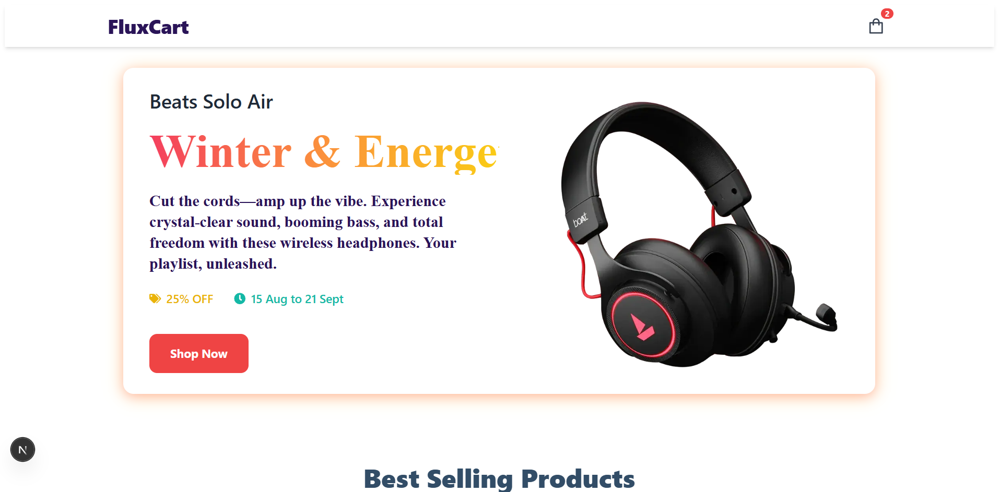
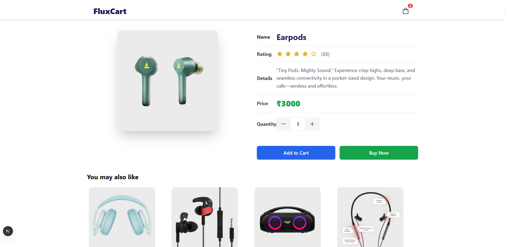
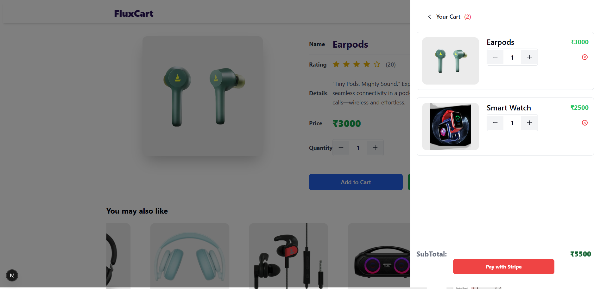

# 🛒 **FluxCart — Modern E-Commerce Platform**

<p align="center">
  
</p>

<div align="center" style="margin-top:10px">
  
  
  
  
  
</div>

---

## 📋 Table of Contents

1. [Introduction](#-introduction)
2. [Technical Description](#-technical-description)
3. [Tech Stack](#-tech-stack)
4. [Features](#-features)
5. [Screenshots](#-screenshots)
6. [Folder Structure](#-folder-structure)
7. [Quick Start](#-quick-start)
8. [Installation](#-installation)
9. [Sanity Setup](#-sanity-setup)
10. [Stripe Setup](#-stripe-setup)
11. [Deployment](#-deployment)
12. [License](#-license)
13. [Acknowledgements](#-acknowledgements)

---

### 🚀 **Introduction**

**FluxCart** is a full-stack e-commerce application designed for **performance, scalability, and seamless user experience**. Built with **Next.js 15** using **Turbopack** for blazing-fast dev performance, **TailwindCSS** for a modern UI, **Sanity CMS** for dynamic content management, and **Stripe** for secure checkout.

---

### 🧠 **Technical Description**

FluxCart follows a **headless e-commerce architecture**. Product data is managed in **Sanity CMS**, fetched dynamically into **Next.js pages** for SEO and SSR optimization. Checkout is powered by **Stripe**, integrated with a custom API route for session creation.

#### ✅ **Key Highlights**

* **Next.js App Router + SSR + ISR** for performance & SEO
* **Stripe Payment Gateway** with Checkout sessions
* **Sanity CMS** for real-time content management
* **React Context API** for global cart state
* **TailwindCSS** for responsive UI
* **Animations** for user engagement using `canvas-confetti`

---

### 🔧 **Tech Stack**

* **Frontend:** Next.js 15, React 19
* **Styling:** TailwindCSS, Tailwind Merge
* **CMS:** Sanity.io
* **Payments:** Stripe
* **State Management:** Context API
* **Icons & UI:** Radix UI, Lucide React, React Icons
* **Notifications:** react-hot-toast
* **Animations:** canvas-confetti
* **Build Tool:** Turbopack (Next.js 15 default)

---

### ✅ **Features**

✔ Dynamic Product Management (Sanity CMS)
✔ Secure Stripe Checkout Integration
✔ Responsive Design for All Devices
✔ Custom 404 Page & Cancel Payment Page
✔ Real-Time Cart State (React Context API)
✔ Smooth Animations on Success Checkout

---

### 🖼 **Screenshots**

| **Homepage**                                  | **Product Details**                                 | **Cart**                                      |
| --------------------------------------------- | --------------------------------------------------- | --------------------------------------------- |
|  |  |  |

---

### 📂 **Folder Structure**

```
fluxcart/
├── pages/
│   ├── index.js            # Homepage
│   ├── product/[slug].js   # Product Details Page
│   ├── success.js          # Stripe Success Page
│   ├── canceled.js         # Payment Canceled Page
│   └── 404.js              # Custom 404 Page
├── components/             # UI Components
├── context/
│   └── StateContext.js     # Global Cart State
├── lib/
│   ├── client.js           # Sanity Client
│   ├── getStripe.js        # Stripe Utility
│   └── utils.js            # Fireworks Animation
├── public/
│   └── assets/             # Images, Screenshots
├── styles/
│   └── globals.css         # TailwindCSS Styles
└── tailwind.config.js      # Tailwind Config
```

---

### ⚡ **Quick Start**

#### ✅ Prerequisites

* Node.js ≥ 18
* Stripe Account
* Sanity Project Setup

---

## 🛠 **Installation**

```bash
git clone https://github.com/KarthickRamAlagar/FluxCart.git
npm install
```

Start development:

```bash
npm run dev
```

App will run on:

```
http://localhost:3000
```

Build for production:

```bash
npm run build
npm start
```

---

### 🔑 **Sanity Setup**

1. Install Sanity CLI:

```bash
npm install -g @sanity/cli
```

2. Initialize Sanity Project:

```bash
sanity init
```

3. Configure schemas for products and banners.

4. Add `NEXT_PUBLIC_SANITY_PROJECT_ID` & `NEXT_PUBLIC_SANITY_DATASET` in `.env.local`.

---

### 💳 **Stripe Setup**

1. Create a [Stripe Account](https://stripe.com).
2. Get API keys:

   * `STRIPE_SECRET_KEY`
   * `NEXT_PUBLIC_STRIPE_PUBLISHABLE_KEY`
3. Add them to `.env.local`:

```
STRIPE_SECRET_KEY=your_secret_key
NEXT_PUBLIC_STRIPE_PUBLISHABLE_KEY=your_publishable_key
```

4. Use `/api/stripe` route for creating checkout sessions.

---

### ☁ **Deployment**

Deploy easily on **Vercel**:

```bash
vercel
```

Add environment variables in Vercel dashboard.

---

## 🪪 **License**

MIT License

---

## 🙏 **Acknowledgements**

* [Next.js](https://nextjs.org)
* [Sanity](https://sanity.io)
* [Stripe](https://stripe.com)
* [TailwindCSS](https://tailwindcss.com)
* [React Icons](https://react-icons.github.io/react-icons)

---


